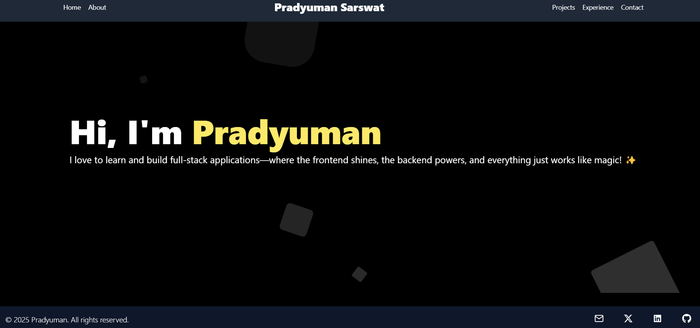

# 🌟 Pradyuman's Portfolio

Welcome to Pradyuman's portfolio project! This project is built using React and showcases my work, skills, and experience. Follow the instructions below to clone the project and run it locally.



## 🚀 Quick Start

Get up and running with my portfolio in just a few steps!

### Step 1: Clone the Repository

```bash
git clone https://github.com/Pradyumansarswat/portfolio-pradyuman.git
cd portfolio-pradyuman
```

### Step 2: Install Dependencies

```bash
npm install
```

This installs all the required dependencies for the project.

### Step 3: Start the Development Server

```bash
npm start
```

Visit [http://localhost:3000/](http://localhost:3000/) to see the app in action!

## 🧪 Running Tests

To launch the test runner in the interactive watch mode, run:

```bash
npm test
```

See the section about [running tests](https://facebook.github.io/create-react-app/docs/running-tests) for more information.

## 📦 Building for Production

To build the app for production to the `build` folder, run:

```bash
npm run build
```

The build process optimizes the app for the best performance. The build is minified, and the filenames include hashes. Your app is ready to be deployed!

See the section about [deployment](https://facebook.github.io/create-react-app/docs/deployment) for more information.

## ⚙️ Ejecting

**Note: this is a one-way operation. Once you `eject`, you can't go back!**

If you aren't satisfied with the build tool and configuration choices, you can `eject` at any time. This command will remove the single build dependency from your project.

```bash
npm run eject
```

It will copy all the configuration files and the transitive dependencies (webpack, Babel, ESLint, etc.) right into your project, giving you full control over them. All of the commands except `eject` will still work, but they will point to the copied scripts so you can tweak them.

## 📚 Learn More

You can learn more in the [Create React App documentation](https://facebook.github.io/create-react-app/docs/getting-started).

To learn React, check out the [React documentation](https://reactjs.org/).

### Additional Resources

- [Code Splitting](https://facebook.github.io/create-react-app/docs/code-splitting)
- [Analyzing the Bundle Size](https://facebook.github.io/create-react-app/docs/analyzing-the-bundle-size)
- [Making a Progressive Web App](https://facebook.github.io/create-react-app/docs/making-a-progressive-web-app)
- [Advanced Configuration](https://facebook.github.io/create-react-app/docs/advanced-configuration)
- [Deployment](https://facebook.github.io/create-react-app/docs/deployment)
- [npm run build fails to minify](https://facebook.github.io/create-react-app/docs/troubleshooting#npm-run-build-fails-to-minify)

## 📞 Contact

For support, contact:

- 🐦 Twitter: [@PradyumanCodes](https://x.com/PradyumanCodes)
- 📌 GitHub: [Pradyumansarswat](https://github.com/Pradyumansarswat)

Feel free to reach out if you have any questions or feedback!

# 🎉 Thank You for Visiting!
